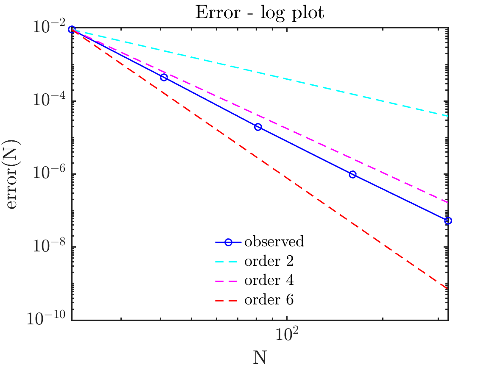
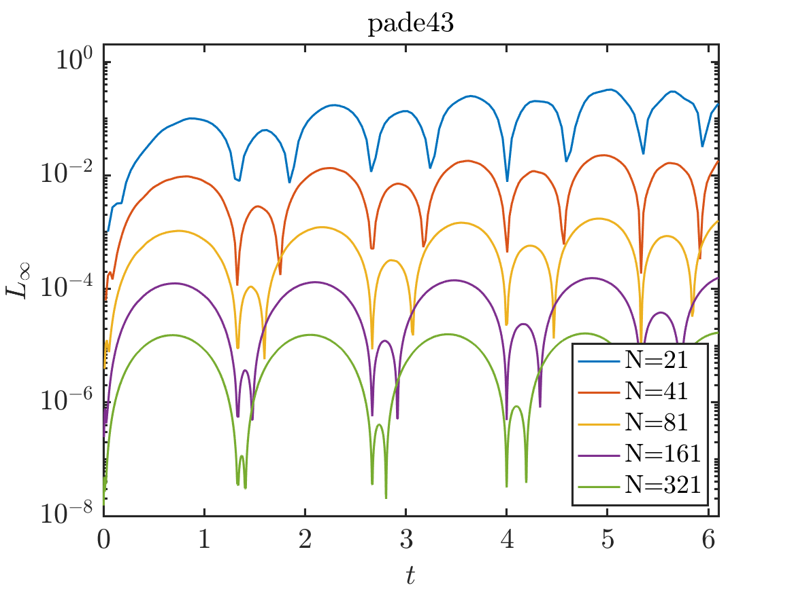

# OrderOfAccuracy
Basic template to examine the order of accuracy (OOA) and stability of numerical operators and numerical solvers of PDEs and systems of PDEs.

This repository is aimed to verify and reproduce some of the results in:

- [1] Lele, Sanjiva K. "Compact finite difference schemes with spectral-like resolution." Journal of computational physics 103.1 (1992): 16-42.
- [2] Brady, P. T., & Livescu, D. (2019). High-order, stable, and conservative boundary schemes for central and compact finite differences. Computers & Fluids, 183, 84-101.

### Test: Standing wave 1d

|  Test     |    Pade43   |    Lele643   |
|:---------:|:-----------:|:------------:|
| OOA       |  |  |
| Stability | |  |
